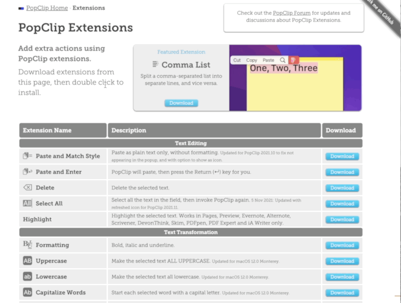
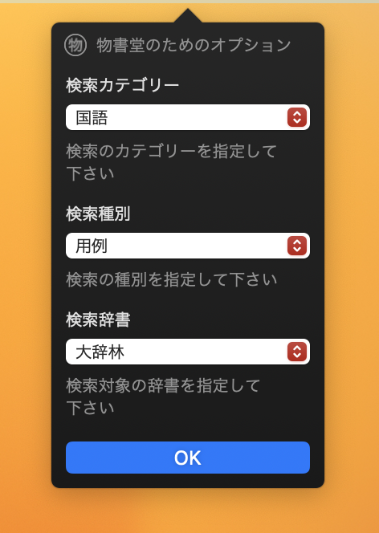

物書堂 PopClip Extension
====

PopClipの物書堂Extensionです

最新版を[release](https://github.com/shivase/popclip-monokakido/releases)より取得してインストールして下さい。

## オプション

検索カテゴリや検索種別を指定することができます。
頻繁に利用する場合は、設定しておくことでスムーズに検索結果が表示されるようになります。

### 検索カテゴリ

* 国語
* アクセント
* 古語
* 漢和
* 英英
* 英和
* 中国語
* 韓国語
* フランス語
* ドイツ語
* イタリア語
* スペイン語
* ポルトガル語
* ロシア語
* タイ語

### 検索種別

* 見出
* 成句
* 用例
* 語義
* 漢字
* 中日
* 日中

[URLスキームで検索カテゴリや検索種別を指定して検索する](https://www.monokakido.jp/ja/dictionaries/app/usage.html#usage_57)
